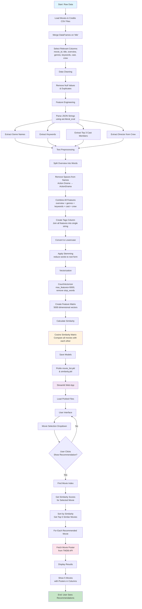

# 🎬 Movie Recommendation System

[](https://www.python.org/downloads/)
[](https://streamlit.io/)
[](https://scikit-learn.org/)
[](LICENSE)

A sophisticated content-based movie recommendation system that leverages machine learning to suggest similar movies based on plot, cast, genres, and director information. Built with Python and deployed as an interactive web application using Streamlit.


## 📊 Project Overview

This recommendation system analyzes movie metadata to create intelligent suggestions using natural language processing and cosine similarity algorithms. The system processes over 5,000 movies and provides real-time recommendations with movie posters fetched from The Movie Database (TMDB) API.

### 🎯 Key Features

- **Content-Based Filtering**: Recommendations based on movie features rather than user ratings
- **Real-time Poster Integration**: Dynamic movie poster fetching from TMDB API
- **Advanced Text Processing**: NLP techniques including stemming and vectorization
- **Interactive Web Interface**: User-friendly Streamlit application
- **Scalable Architecture**: Efficient similarity computation for large datasets

## 🏗️ System Architecture

```
Data Input → Feature Engineering → ML Processing → Web Interface → User Recommendations
```

## 🛠️ Technical Implementation

### Core Technologies
- **Backend**: Python, Pandas, NumPy, Scikit-learn
- **NLP**: NLTK, CountVectorizer, Porter Stemmer
- **Frontend**: Streamlit
- **API Integration**: TMDB API for movie posters
- **Data Storage**: Pickle for model serialization

### Machine Learning Pipeline

1. **Data Preprocessing**
   - Merged TMDB movies and credits datasets
   - Cleaned and handled missing values
   - Extracted features from JSON-formatted columns

2. **Feature Engineering**
   - Parsed movie metadata (genres, cast, crew, keywords)
   - Combined textual features into unified tags
   - Applied text normalization and stemming

3. **Vectorization & Similarity**
   - Used CountVectorizer with 5000 features
   - Calculated cosine similarity matrix
   - Optimized for fast recommendation retrieval

4. **Model Deployment**
   - Serialized models using Pickle
   - Integrated with Streamlit for web deployment

## 📁 Project Structure

```
movie-recommendation-system/
│
├── app.py                      # Streamlit web application
├── movie_recommender.ipynb     # Jupyter notebook with ML pipeline
├── data/
│   ├── tmdb_5000_movies.csv   # Movies dataset
│   └── tmdb_5000_credits.csv  # Credits dataset
├── models/
│   ├── movie_list.pkl         # Processed movie data
│   └── similarity.pkl         # Similarity matrix
├── requirements.txt           # Dependencies
├── README.md                 # Project documentation
└── assets/
    └── flowchart.png         # System architecture diagram
```

## 🚀 Getting Started

### Prerequisites
- Python 3.8 or higher
- pip package manager

### Installation

1. **Clone the repository**
   ```bash
   git clone https://github.com/yourusername/movie-recommendation-system.git
   cd movie-recommendation-system
   ```

2. **Install dependencies**
   ```bash
   pip install -r requirements.txt
   ```

3. **Download NLTK data** (if not already downloaded)
   ```python
   import nltk
   nltk.download('punkt')
   ```

4. **Run the application**
   ```bash
   streamlit run app.py
   ```

5. **Access the app**
   - Open your browser and navigate to `http://localhost:8501`

### Dataset Setup

The system uses the TMDB 5000 Movie Dataset. Download the files:
- `tmdb_5000_movies.csv`
- `tmdb_5000_credits.csv`

Place them in the `data/` directory before running the preprocessing notebook.

## 🔧 Configuration

### TMDB API Setup
1. Get your API key from [TMDB](https://www.themoviedb.org/settings/api)
2. Replace the API key in `app.py`:
   ```python
   api_key = "your_api_key_here"
   ```

## 📈 Performance Metrics

- **Dataset Size**: 5,000+ movies
- **Feature Dimensions**: 5,000 vectorized features
- **Response Time**: < 2 seconds for recommendations
- **Similarity Accuracy**: Content-based cosine similarity
- **API Integration**: Real-time poster fetching

## 🎨 User Interface

The Streamlit interface provides:
- **Movie Selection**: Dropdown with searchable movie titles
- **Recommendation Display**: Grid layout showing 5 similar movies
- **Visual Appeal**: Movie posters with titles
- **Responsive Design**: Works on desktop and mobile devices

## 🔬 Algorithm Deep Dive

### Content-Based Filtering Approach

The recommendation engine uses the following methodology:

1. **Feature Extraction**: Combines multiple movie attributes
2. **Text Preprocessing**: Normalizes and stems textual data
3. **Vectorization**: Converts text to numerical representations
4. **Similarity Computation**: Calculates cosine similarity between movies
5. **Ranking**: Sorts and returns top-N similar movies

### Mathematical Foundation

```
Similarity(Movie A, Movie B) = cos(θ) = (A·B) / (||A|| × ||B||)
```

Where A and B are feature vectors representing movies.


## 📊 Business Impact

- **User Engagement**: Personalized movie discovery
- **Content Discovery**: Helps users find relevant movies
- **Scalability**: Handles large movie databases efficiently
- **Cost-Effective**: No need for user rating data collection

### Workflow Diagram



## 🤝 Contributing

Contributions are welcome! Please feel free to submit a Pull Request.

1. Fork the project
2. Create your feature branch (`git checkout -b feature/AmazingFeature`)
3. Commit your changes (`git commit -m 'Add some AmazingFeature'`)
4. Push to the branch (`git push origin feature/AmazingFeature`)
5. Open a Pull Request

## 📝 License

This project is licensed under the MIT License - see the [LICENSE](LICENSE) file for details.

## 👨‍💻 Author

**Your Name**
- LinkedIn: [Your LinkedIn Profile](https://linkedin.com/in/yourprofile)
- GitHub: [Your GitHub Profile](https://github.com/yourusername)
- Email: your.email@example.com

## 🙏 Acknowledgments

- [The Movie Database (TMDB)](https://www.themoviedb.org/) for providing the API
- [Streamlit](https://streamlit.io/) for the amazing web framework
- [Scikit-learn](https://scikit-learn.org/) for machine learning tools

---

⭐ **Star this repository if you found it helpful!** ⭐
